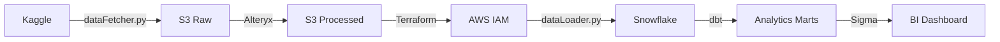

<div align="center">

# Modern Data Stack: Supply Chain Analytics (2025)

> A production-ready data pipeline showcasing AWS S3, Alteryx, Terraform, Snowflake, dbt, and Sigma Computing

<div align="center">
  
</div>

</div>

---

## Overview

End-to-end data pipeline processing **180K+ orders** and **470K+ clickstream events** through a modern data stack: automated ingestion, cloud storage, visual ETL, infrastructure as code, data warehousing, SQL transformations, and interactive BI dashboards.

---

## Architecture

<div align="center">



</div>

---

## Tech Stack

| Component | Technology |
|-----------|-----------|
| Data Source | Kaggle API |
| Storage | AWS S3 |
| ETL | Alteryx Designer Cloud |
| Infrastructure | Terraform |
| Data Warehouse | Snowflake |
| Transformations | dbt |
| BI & Analytics | Sigma Computing |

---

## Quick Start

```bash
./setup.sh
cp .env.example .env  # Add credentials
python dataFetcher/dataFetcher.py
```

See individual component READMEs for detailed setup:
- [`dataFetcher/`](./dataFetcher/README.md) - Kaggle → S3
- [`alteryxWorkflows/`](./alteryxWorkflows/README.md) - Data preparation
- [`terraform/`](./terraform/README.md) - Infrastructure setup
- [`snowflakeIngestion/`](./snowflakeIngestion/README.md) - S3 → Snowflake
- [`dbtTransformations/`](./dbtTransformations/README.md) - SQL transformations

---

## Project Structure

```
Project/
├── dataFetcher/              # Kaggle → S3 pipeline
├── alteryxWorkflows/         # Alteryx ETL workflows
├── terraform/                # Terraform IaC
├── snowflakeIngestion/       # S3 → Snowflake loader
├── dbtTransformations/       # dbt SQL models
├── rawData (reference only)/ # Sample raw data
└── processedData (reference only)/ # Sample processed data
```

---

## Business Intelligence Dashboard

**Sigma Computing** dashboard connected to Snowflake `MARTSALESPERFORMANCE` table. See dashboard screenshot above.

**To recreate:** Connect Sigma to Snowflake, select analytics mart tables, and build visualizations.

---

## Dataset

- **Source:** [DataCo Supply Chain Dataset](https://data.mendeley.com/datasets/8gx2fvg2k6/5) (Mendeley)
- **Orders:** 180,519 rows (53 → 58 columns after enrichment)
- **Clickstream:** 469,977 rows (8 → 20 columns after enrichment)

---

## License

MIT - See [LICENSE](./LICENSE)
