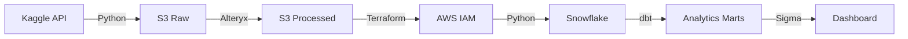

<div align="center">

# Modern Supply Chain Analytics Platform

**Production-grade data pipeline processing 650K+ records through AWS, Snowflake, dbt, and Alteryx**


[](LICENSE)
[](https://aws.amazon.com/s3/)
[](https://www.snowflake.com/)
[](https://www.getdbt.com/)
[](https://www.terraform.io/)

</div>

---

## Overview

End-to-end analytics pipeline demonstrating enterprise data engineering practices. Automates the journey from raw Kaggle datasets to interactive business intelligence dashboards—processing 180K orders and 470K clickstream events through a modern data stack.

**Built to showcase:** Cloud data lakes, visual ETL workflows, infrastructure as code, dimensional modeling, and self-service BI. Each component folder contains detailed technical documentation.

---

## Architecture


**Six-stage pipeline:** Kaggle ingestion → S3 storage → Alteryx transformation → Terraform provisioning → Snowflake loading → dbt modeling → Sigma visualization.

---

## Tech Stack

| Layer | Technology | Purpose |
|-------|-----------|---------|
| **Source** | Kaggle API | Automated dataset downloads |
| **Storage** | AWS S3 | Multi-layer data lake (raw/processed) |
| **ETL** | Alteryx Designer Cloud | Visual workflows for data prep |
| **Infrastructure** | Terraform | AWS IAM provisioning |
| **Warehouse** | Snowflake | Cloud data warehouse |
| **Transformation** | dbt | SQL-based dimensional modeling |
| **Visualization** | Sigma Computing | Interactive BI dashboards |

---

## Quick Start
```bash
# Clone and configure
git clone <repo-url>
cp .env.example .env  # Add credentials

# Run pipeline
pip install -r requirements.txt
python dataFetcher/dataFetcher.py
```

Each component has step-by-step setup documentation in its folder.

---

## Project Structure
```
├── dataFetcher/          # Kaggle API → S3 automated ingestion
├── alteryxWorkflows/     # ETL workflows with enrichment logic
├── terraform/            # AWS IAM infrastructure as code
├── snowflakeIngestion/   # S3 → Snowflake loading scripts
├── dbtTransformations/   # Dimensional models & analytics marts
├── rawData/              # Sample raw data (reference)
└── processedData/        # Sample processed data (reference)
```

**Documentation:** Each folder's README contains implementation details, configuration steps, and technical decisions.

---

## Pipeline Components

### Data Fetcher
Python automation using Kaggle API and boto3. Downloads datasets and uploads to S3 data lake with error handling and logging.  
→ [Technical Documentation](./dataFetcher/README.md)

### Alteryx Workflows
Visual ETL processes that clean, validate, and enrich raw data. Adds calculated fields, temporal patterns, and session tracking to both orders and clickstream datasets.  
→ [Workflow Details](./alteryxWorkflows/README.md)

### Terraform Infrastructure
Two-phase IaC approach provisioning AWS IAM roles with S3 read permissions for Snowflake. Manages external ID rotation and secure credential handling.  
→ [Infrastructure Guide](./terraform/README.md)

### Snowflake Ingestion
Python loader using `COPY INTO` commands to stage processed S3 data into Snowflake schemas (RAWDATA, ANALYTICALDATA, MARTDATA).  
→ [Loading Process](./snowflakeIngestion/README.md)

### dbt Transformations
SQL-based data modeling following staging → dimensions → facts → marts pattern. Creates reusable, tested analytics models with documentation.  
→ [Model Documentation](./dbtTransformations/README.md)

### Sigma Dashboard
Interactive BI layer connected directly to Snowflake marts. Real-time KPIs, trend analysis, and drill-down capabilities for business users.

---

## Data Flow

**180,519 orders** | **469,977 clickstream events** → **650K+ total records**

| Stage | Description | Output |
|-------|-------------|--------|
| Raw | Kaggle datasets uploaded to S3 | 53 & 8 columns respectively |
| Processed | Alteryx enrichment & validation | 58 & 20 columns |
| Staged | Snowflake raw tables | Queryable warehouse |
| Modeled | dbt dimensional models | Fact & dimension tables |
| Marts | Pre-aggregated analytics | Dashboard-ready datasets |

---

## Key Features

**Infrastructure**
- Environment-based configuration management
- Infrastructure as Code with Terraform
- Secure credential handling (never committed)
- AWS IAM least-privilege access

**Data Quality**
- Alteryx validation rules and data profiling
- dbt tests for model integrity
- Error handling throughout pipeline
- Logging at each stage

**Analytics**
- Dimensional modeling (Kimball methodology)
- Pre-aggregated marts for BI performance
- Self-service analytics through Sigma
- Drill-down and filtering capabilities

---

## Dataset

**Source:** [DataCo SMART SUPPLY CHAIN](https://data.mendeley.com/datasets/8gx2fvg2k6/5) via Mendeley Research

Real-world supply chain and e-commerce data spanning multiple years of transaction history. Used to demonstrate end-to-end pipeline capabilities from raw data to business insights.

---

## Environment Setup

Required credentials in `.env`:
- Kaggle API token
- AWS access keys (S3 permissions)
- Snowflake account details (account, user, password, warehouse, database)

See `.env.example` for template.

---

## License

MIT License - See [LICENSE](./LICENSE)

---

<div align="center">

**Built with modern data engineering tools and best practices**

</div>
