# Modern Data Stack: Supply Chain Analytics (2025)

> A production-ready data pipeline showcasing AWS S3, Alteryx, Terraform, Snowflake, dbt, and Sigma Computing

<!-- Dashboard Image Placeholder -->
<!-- Add your Sigma dashboard screenshot here -->

---

## What This Is

A complete end-to-end data pipeline demonstrating modern data engineering and business intelligence tools. We process **180K+ supply chain orders** and **470K+ clickstream events** through a multi-stage architecture that transforms raw data into actionable business insights.

This project showcases real-world data engineering practices: automated data ingestion, cloud storage, visual ETL, infrastructure as code, data warehousing, SQL transformations, and interactive BI dashboards.

---

## Architecture

```mermaid
graph TB
    A[Kaggle Dataset] -->|dataFetcher.py| B[AWS S3<br/>Raw Data]
    B -->|Alteryx Designer Cloud| C[AWS S3<br/>Processed Data]
    C -->|Terraform| D[AWS IAM Role<br/>Snowflake Integration]
    D -->|dataLoader.py| E[Snowflake<br/>Data Warehouse]
    E -->|dbt Transformations| F[Analytics Marts<br/>Staging → Dimensions → Facts]
    F -->|Sigma Computing| G[Interactive BI Dashboard]
```



**Pipeline Flow:**
1. **Data Ingestion** - Automated download from Kaggle API to AWS S3
2. **Data Preparation** - Alteryx Designer Cloud workflows clean and enrich data
3. **Infrastructure** - Terraform provisions AWS IAM roles for secure Snowflake access
4. **Data Warehouse** - Snowflake stores and organizes data in structured schemas
5. **Transformations** - dbt models create analytics-ready datasets (staging → dimensions → facts → marts)
6. **Visualization** - Sigma Computing dashboard provides interactive business intelligence

---

## Tech Stack

| Layer | Technology | Purpose |
|-------|-----------|---------|
| **Data Source** | Kaggle API | Automated dataset downloads |
| **Storage** | AWS S3 | Data lake (raw & processed layers) |
| **ETL** | Alteryx Designer Cloud | Visual data preparation workflows |
| **Infrastructure** | Terraform | Infrastructure as Code (AWS IAM) |
| **Data Warehouse** | Snowflake | Centralized analytics database |
| **Transformations** | dbt (data build tool) | SQL-based data modeling |
| **BI & Analytics** | Sigma Computing | Interactive dashboards |

---

## Quick Start

**Prerequisites:** Python 3.8+, AWS account, Snowflake account, Alteryx access, Terraform, dbt-snowflake

```bash
# 1. Setup
./setup.sh
cp .env.example .env  # Add your credentials

# 2. Run the pipeline
python dataFetcher/dataFetcher.py              # Fetch data → S3
# Then follow instructions in each folder:
# - alteryxWorkflows/README.md (Alteryx ETL)
# - terraform/README.md (Infrastructure setup)
# - snowflakeIngestion/README.md (Snowflake loading)
# - dbtTransformations/README.md (dbt transformations)
```

Each component folder has detailed step-by-step guides.

---

## Project Structure

```
Project/
├── dataFetcher/              # Kaggle → S3 automated pipeline
├── alteryxWorkflows/         # Alteryx ETL workflows & formulas
├── terraform/                # Terraform IaC (AWS IAM)
├── snowflakeIngestion/       # S3 → Snowflake data loader
├── dbtTransformations/       # dbt SQL transformation models
├── rawData (reference only)/ # Sample raw data (15 rows)
└── processedData (reference only)/ # Sample processed data
```

---

## Components

### 📥 Data Fetcher (Python + AWS S3)
Automated pipeline using Kaggle API and boto3. Downloads datasets and uploads to S3 data lake.

[](./dataFetcher/README.md)


### 🔄 Alteryx Designer Cloud
Visual ETL workflows that clean, standardize, and enrich raw datasets. Adds calculated fields, temporal patterns, and session tracking.

📖 [Details →](./alteryxWorkflows/README.md)

### ☁️ Terraform (Infrastructure as Code)
Provisions AWS IAM roles with S3 read permissions for Snowflake storage integration. Two-phase approach for secure credential management.

📖 [Details →](./terraform/README.md)

### ❄️ Snowflake Data Warehouse
Loads processed data from S3 into Snowflake using `COPY INTO` commands. Creates structured schemas (RAWDATA, ANALYTICALDATA, MARTDATA).

📖 [Details →](./snowflakeIngestion/README.md)

### 🔧 dbt Transformations
SQL-based data modeling following best practices: staging → dimensions → facts → analytics marts. Creates reusable, tested data models.

📖 [Details →](./dbtTransformations/README.md)

---

## Visualization: Sigma Dashboard

The final layer uses **Sigma Computing** to create interactive business intelligence dashboards connected directly to Snowflake analytics marts.

**Connection:** Sigma → Snowflake → `MARTSALESPERFORMANCE` table

**Features:**
- Real-time data from Snowflake analytics marts
- Interactive KPI cards and charts
- Professional design with consistent color schemes
- Drill-down capabilities for deeper analysis

**To recreate:** Connect Sigma to Snowflake, select the analytics mart tables, and build visualizations. See dashboard screenshot above for reference.

---

## Data

- **Source:** [DataCo Supply Chain Dataset](https://data.mendeley.com/datasets/8gx2fvg2k6/5) (Mendeley Research)
- **Orders:** 180,519 rows, 53 columns → 58 columns (after Alteryx enrichment)
- **Clickstream:** 469,977 rows, 8 columns → 20 columns (after Alteryx enrichment)
- **Analytics Marts:** Pre-aggregated tables optimized for BI queries

---

## Environment Variables

See `.env.example` for required credentials:
- Kaggle API token
- AWS credentials (S3 access)
- Snowflake connection details

**Important:** Never commit `.env` to Git.

---

## License

MIT - See [LICENSE](./LICENSE)

---

**Built with:** Python, AWS S3, Alteryx, Terraform, Snowflake, dbt, Sigma Computing
