<div align="center">

# Modern Data Stack: Supply Chain Analytics (2025)

> A production-ready data pipeline showcasing AWS S3, Alteryx, Terraform, Snowflake, dbt, and Sigma Computing

<!-- Dashboard Image Placeholder -->
<div align="center">
  
</div>

<!-- Tech Stack Icons -->
<div align="center">
  <br/>
  
  <!-- dbt Icon -->
  <svg xmlns="http://www.w3.org/2000/svg" fill="none" viewBox="0 0 24 24" id="Dbt--Streamline-Svg-Logos" height="32" width="32" style="margin: 0 10px;">
    <desc>Dbt Streamline Icon: https://streamlinehq.com</desc>
    <path fill="#262a38" d="M15.613875 8.90125v6.124425h-1.241175v-0.624625c-0.1298 0.219025 -0.3163 0.3975 -0.543475 0.51105 -0.24335 0.121675 -0.519175 0.186575 -0.7949 0.186575 -0.340725 0.008125 -0.68145 -0.089225 -0.96535 -0.283925 -0.291975 -0.194675 -0.51915 -0.46235 -0.6652 -0.778725 -0.1622 -0.365025 -0.243325 -0.7544 -0.23525 -1.151875 -0.008075 -0.397475 0.07305 -0.78685 0.23525 -1.14375 0.14605 -0.308275 0.373225 -0.57595 0.657125 -0.762525 0.291975 -0.186575 0.6327 -0.2758 0.973425 -0.2677 0.26765 0 0.5353 0.0568 0.770575 0.178475 0.227175 0.11355 0.4137 0.2839 0.543475 0.494825v-2.068525l1.2655 -0.4137Zm-1.492575 4.915775c0.162175 -0.210925 0.2514 -0.519175 0.2514 -0.91665 0 -0.397475 -0.08105 -0.697625 -0.2514 -0.908525 -0.170375 -0.2109 -0.438125 -0.332575 -0.71385 -0.324475 -0.275825 -0.016225 -0.543475 0.10545 -0.722025 0.316375 -0.17025 0.2109 -0.259575 0.51105 -0.259575 0.9004 0 0.397475 0.089325 0.705725 0.259575 0.92475 0.170375 0.219025 0.4462 0.3407 0.722025 0.3326 0.308225 0 0.55155 -0.113575 0.71385 -0.324475Zm5.929775 -2.84725c0.291975 0.18655 0.51915 0.45425 0.657025 0.7625 0.162175 0.356925 0.243325 0.746275 0.23525 1.143775 0.008075 0.397475 -0.073075 0.79495 -0.23525 1.151875 -0.14605 0.31635 -0.373125 0.58405 -0.6652 0.778725 -0.2839 0.186575 -0.624625 0.283925 -0.96525 0.2758 -0.275825 0.008125 -0.551675 -0.056775 -0.795 -0.186575 -0.227075 -0.11355 -0.4137 -0.292025 -0.5354 -0.511025v0.6327h-1.24915V9.31495l1.257325 -0.4137v2.498425c0.1216 -0.219 0.308225 -0.397475 0.5353 -0.511025 0.243425 -0.1298 0.5111 -0.194675 0.786925 -0.186575 0.340625 -0.0081 0.68135 0.089225 0.973425 0.2677Zm-0.61655 2.839125c0.17035 -0.219025 0.2515 -0.527275 0.2515 -0.93285 0 -0.389375 -0.08115 -0.689525 -0.2515 -0.900425 -0.170375 -0.2109 -0.405625 -0.31635 -0.71385 -0.31635 -0.275725 -0.016225 -0.543475 0.10545 -0.721925 0.324475 -0.17035 0.219 -0.2515 0.51915 -0.2515 0.908525 0 0.397475 0.08115 0.705725 0.2515 0.916625 0.170375 0.219025 0.438025 0.3407 0.721925 0.324475 0.275825 0.016225 0.543475 -0.10545 0.71385 -0.324475Zm3.24475 -2.0604v1.638575c0 0.23525 0.0649 0.4056 0.178525 0.51105 0.1298 0.113575 0.300075 0.17035 0.4786 0.16225 0.137875 0 0.2839 -0.02435 0.4137 -0.0568v0.973425c-0.235275 0.081125 -0.4786 0.121675 -0.722025 0.113575 -0.519075 0 -0.9166 -0.146025 -1.19245 -0.43805 -0.275725 -0.292025 -0.413675 -0.705725 -0.413675 -1.2411V9.817875l1.257325 -0.405575v1.395225h1.070825v0.940975h-1.070825Z" stroke-width="0.25"></path>
    <path fill="#ff694a" d="M8.840425 7.8873c0.2109 0.2028 0.3488 0.4705 0.38125 0.762525 0 0.121675 -0.03245 0.2028 -0.10545 0.3569 -0.073 0.154125 -0.973425 1.7116 -1.2411 2.141525 -0.154125 0.251475 -0.23525 0.551625 -0.23525 0.843625 0 0.30015 0.081125 0.592175 0.23525 0.84365 0.267675 0.429925 1.1681 1.9955 1.2411 2.149625 0.073 0.154125 0.10545 0.227125 0.10545 0.3488 -0.03245 0.292025 -0.16225 0.559725 -0.37315 0.7544 -0.2028 0.2109 -0.470475 0.348825 -0.7544 0.37315 -0.121675 0 -0.2028 -0.03245 -0.3488 -0.10545 -0.146025 -0.073025 -1.735925 -0.9491 -2.16585 -1.216775 -0.03245 -0.016225 -0.0649 -0.040575 -0.10545 -0.0568l-2.1253 -1.257325c0.04865 0.4056 0.227125 0.794975 0.51915 1.078875 0.056775 0.056775 0.113575 0.10545 0.17845 0.154125 -0.048675 0.024325 -0.10545 0.048675 -0.154125 0.081125 -0.429925 0.267675 -1.9955 1.1681 -2.1496225 1.2411 -0.1541225 0.073 -0.2271325 0.10545 -0.3569225 0.10545 -0.292025 -0.03245 -0.559715 -0.162225 -0.7544 -0.373125 -0.2109075 -0.2028 -0.3488075 -0.4705 -0.381255 -0.762525 0.0081125 -0.121675 0.04056 -0.24335 0.105455 -0.3488 0.073005 -0.154125 0.9734175 -1.719725 1.2411025 -2.14965 0.154135 -0.25145 0.2352475 -0.543475 0.2352475 -0.843625 0 -0.300125 -0.0811125 -0.59215 -0.2352475 -0.843625 -0.267685 -0.44615 -1.17621 -2.011725 -1.2411025 -2.16585 -0.064895 -0.10545 -0.0973425 -0.227125 -0.105455 -0.3488 0.0324475 -0.292025 0.1622375 -0.559725 0.373145 -0.762525 0.202795 -0.2109 0.470485 -0.3407 0.76251 -0.37315 0.121675 0.008125 0.24335 0.040575 0.3569225 0.105475 0.12979 0.056775 1.2735475 0.72195 1.8819475 1.078875l0.1379 0.0811c0.04865 0.03245 0.089225 0.056775 0.121675 0.073025l0.0649 0.04055 2.16585 1.281675c-0.048675 -0.486725 -0.30015 -0.932875 -0.6895 -1.233 0.048675 -0.02435 0.10545 -0.048675 0.154125 -0.081125 0.429925 -0.2677 1.9955 -1.176225 2.149625 -1.2411 0.10545 -0.0649 0.227125 -0.09735 0.356925 -0.105475 0.2839 0.03245 0.5516 0.16225 0.7544 0.37315ZM4.8494 12.57595l0.462375 -0.4624c0.0649 -0.064875 0.0649 -0.162225 0 -0.227125l-0.462375 -0.462375c-0.0649 -0.0649 -0.162225 -0.0649 -0.227125 0l-0.462375 0.462375c-0.0649 0.0649 -0.0649 0.16225 0 0.227125l0.462375 0.4624c0.056775 0.056775 0.162225 0.056775 0.227125 0Z" stroke-width="0.25"></path>
  </svg>
  
  <!-- Snowflake Icon -->
  
  
  <!-- Alteryx Icon -->
  
  
  <!-- Sigma Icon -->
  
  
  <!-- AWS S3 Icon -->
  
  
  <!-- Terraform Icon -->
  
  
  <br/>
</div>

</div>

---

## What This Is

A complete end-to-end data pipeline demonstrating modern data engineering and business intelligence tools. We process **180K+ supply chain orders** and **470K+ clickstream events** through a multi-stage architecture that transforms raw data into actionable business insights.

This project showcases real-world data engineering practices: automated data ingestion, cloud storage, visual ETL, infrastructure as code, data warehousing, SQL transformations, and interactive BI dashboards.

---

## Architecture

```mermaid
graph TB
    A[Kaggle Dataset] -->|dataFetcher.py| B[AWS S3<br/>Raw Data]
    B -->|Alteryx Designer Cloud| C[AWS S3<br/>Processed Data]
    C -->|Terraform| D[AWS IAM Role<br/>Snowflake Integration]
    D -->|dataLoader.py| E[Snowflake<br/>Data Warehouse]
    E -->|dbt Transformations| F[Analytics Marts<br/>Staging → Dimensions → Facts]
    F -->|Sigma Computing| G[Interactive BI Dashboard]
```

<div align="center">



</div>

**Pipeline Flow:**
1. **Data Ingestion** - Automated download from Kaggle API to AWS S3
2. **Data Preparation** - Alteryx Designer Cloud workflows clean and enrich data
3. **Infrastructure** - Terraform provisions AWS IAM roles for secure Snowflake access
4. **Data Warehouse** - Snowflake stores and organizes data in structured schemas
5. **Transformations** - dbt models create analytics-ready datasets (staging → dimensions → facts → marts)
6. **Visualization** - Sigma Computing dashboard provides interactive business intelligence

---

## Tech Stack

<div align="center">

| Layer | Technology | Purpose |
|-------|-----------|---------|
| **Data Source** | Kaggle API | Automated dataset downloads |
| **Storage** | AWS S3 | Data lake (raw & processed layers) |
| **ETL** | Alteryx Designer Cloud | Visual data preparation workflows |
| **Infrastructure** | Terraform | Infrastructure as Code (AWS IAM) |
| **Data Warehouse** | Snowflake | Centralized analytics database |
| **Transformations** | dbt (data build tool) | SQL-based data modeling |
| **BI & Analytics** | Sigma Computing | Interactive dashboards |

</div>

---

## Quick Start

**Prerequisites:** Python 3.8+, AWS account, Snowflake account, Alteryx access, Terraform, dbt-snowflake

```bash
# 1. Setup
./setup.sh
cp .env.example .env  # Add your credentials

# 2. Run the pipeline
python dataFetcher/dataFetcher.py              # Fetch data → S3
# Then follow instructions in each folder:
# - alteryxWorkflows/README.md (Alteryx ETL)
# - terraform/README.md (Infrastructure setup)
# - snowflakeIngestion/README.md (Snowflake loading)
# - dbtTransformations/README.md (dbt transformations)
```

Each component folder has detailed step-by-step guides.

---

## Project Structure

```
Project/
├── dataFetcher/              # Kaggle → S3 automated pipeline
├── alteryxWorkflows/         # Alteryx ETL workflows & formulas
├── terraform/                # Terraform IaC (AWS IAM)
├── snowflakeIngestion/       # S3 → Snowflake data loader
├── dbtTransformations/       # dbt SQL transformation models
├── rawData (reference only)/ # Sample raw data (15 rows)
└── processedData (reference only)/ # Sample processed data
```

---

## Components

### 📥 Data Fetcher (Python + AWS S3)
Automated pipeline using Kaggle API and boto3. Downloads datasets and uploads to S3 data lake.

<div align="center">

[](./dataFetcher/README.md)

</div>

### 🔄 Alteryx Designer Cloud
Visual ETL workflows that clean, standardize, and enrich raw datasets. Adds calculated fields, temporal patterns, and session tracking.

<div align="center">

[](./alteryxWorkflows/README.md)

</div>

### ☁️ Terraform (Infrastructure as Code)
Provisions AWS IAM roles with S3 read permissions for Snowflake storage integration. Two-phase approach for secure credential management.

<div align="center">

[](./terraform/README.md)

</div>

### ❄️ Snowflake Data Warehouse
Loads processed data from S3 into Snowflake using `COPY INTO` commands. Creates structured schemas (RAWDATA, ANALYTICALDATA, MARTDATA).

<div align="center">

[](./snowflakeIngestion/README.md)

</div>

### 🔧 dbt Transformations
SQL-based data modeling following best practices: staging → dimensions → facts → analytics marts. Creates reusable, tested data models.

<div align="center">

[](./dbtTransformations/README.md)

</div>

---

## Visualization: Sigma Dashboard

The final layer uses **Sigma Computing** to create interactive business intelligence dashboards connected directly to Snowflake analytics marts.

**Connection:** Sigma → Snowflake → `MARTSALESPERFORMANCE` table

**Features:**
- Real-time data from Snowflake analytics marts
- Interactive KPI cards and charts
- Professional design with consistent color schemes
- Drill-down capabilities for deeper analysis

**To recreate:** Connect Sigma to Snowflake, select the analytics mart tables, and build visualizations. See dashboard screenshot above for reference.

---

## Data

- **Source:** [DataCo Supply Chain Dataset](https://data.mendeley.com/datasets/8gx2fvg2k6/5) (Mendeley Research)
- **Orders:** 180,519 rows, 53 columns → 58 columns (after Alteryx enrichment)
- **Clickstream:** 469,977 rows, 8 columns → 20 columns (after Alteryx enrichment)
- **Analytics Marts:** Pre-aggregated tables optimized for BI queries

---

## Environment Variables

See `.env.example` for required credentials:
- Kaggle API token
- AWS credentials (S3 access)
- Snowflake connection details

**Important:** Never commit `.env` to Git.

---

<div align="center">

## License

MIT - See [LICENSE](./LICENSE)

---

**Built with:** Python, AWS S3, Alteryx, Terraform, Snowflake, dbt, Sigma Computing

</div>
